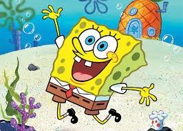
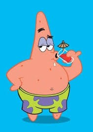
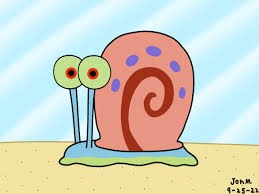
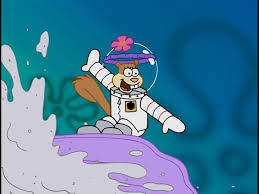

# Meet the Team

  

    
    <h3>You!</h3>
    
You get to be first because you created this.

  

  

    
    <h3>Me!</h3>
    
I'm Next because who cares!.

  

  

    
    <h3>Kid 3</h3>
    
Has hair, enjoys pony rides.

  

  

    
    <h3>Kid 4</h3>
    
Also has hair, but hates pony rides.

  

  

    
    <h3>Kid 5</h3>
    
Invented the question mark.

  

  

    
    <h3>Kid 6</h3>
    
There are 6 of us, right?

  

